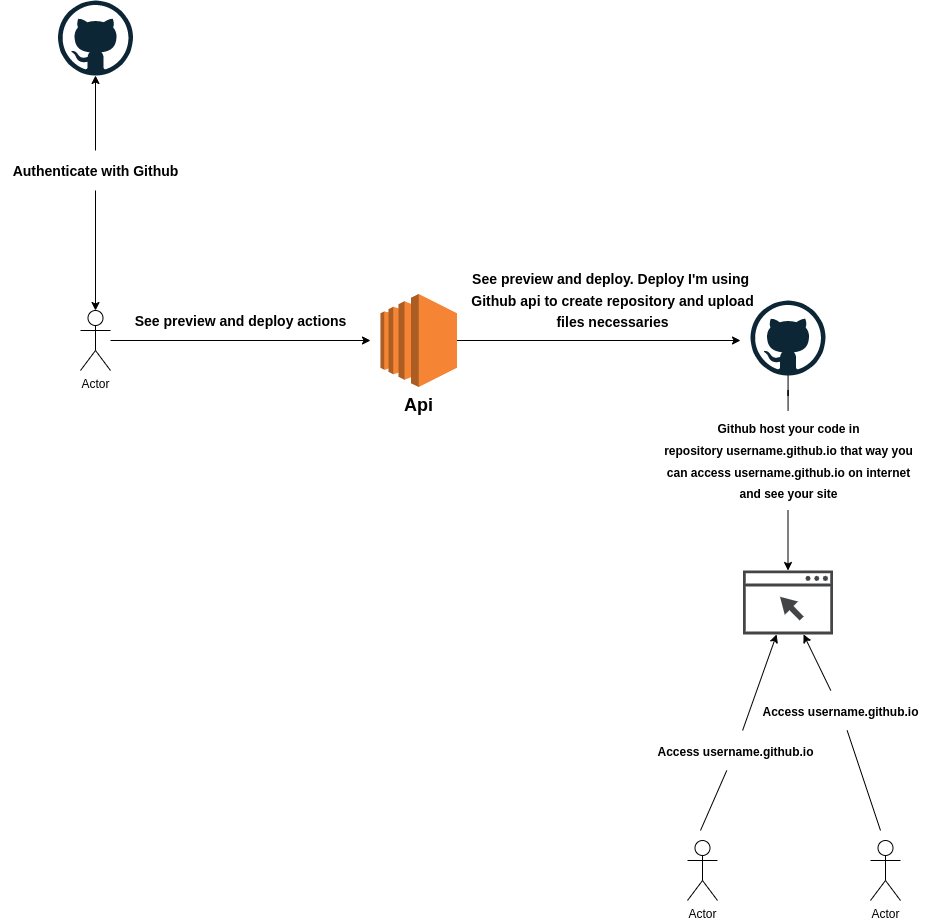

About:
=========

This project I build one solution where people populate json data, can see preview site with json data, can see preview pt-BR and en-US of site and finally if all thinks ok deploy application.

How to use to build project:
============================

- Javascript
- Node.js
- Express.js
- Ejs
- OAuth
- Api Gitub
- Bootstrap

Architecture and flow:
========================

Explain image above:
-----------------------

- User make authentication with Github because more later application need use api Github
- After user authenticated you populate json data on form and can see preview your site on two languages: portuguese and english.
- If all thinks ok after see site preview you can deploy site.
- To deploy your site I will create one repository named username_user_github.github.io and send site files to this repository using api Github, when you create this one repository username_user_github.github.io the Github will create for you one site with files this repository, to needs only open your browser and type in search bar this address username_user_github.github.io this way can see your site. Observation: The most interesting here that is free, you don't pay per this domain.

How to running application locally:
==================================

- Clone
- Execute command **npm install** to install modules necessaries on project
- Create **.env** file based **.env.example**
- Execute command **npm run start:dev** to running application at address: http://localhost:3000
